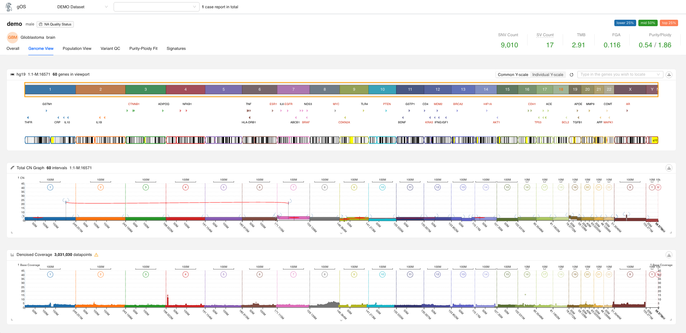

# gOS Case Report (prebuilt)

This repository now ships prebuilt bundles via **GitHub Releases** and publishes the latest build to **GitHub Pages**. You can run the app locally without rebuilding, explore the demo data baked into `shared/`, or develop from source with the usual React tooling.



## Quick start (no build required)
Prereqs: `python3`, `curl`, and `tar`. Optionally set `GITHUB_TOKEN` to avoid GitHub API rate limits.

```bash
./setup.sh
open http://localhost:3001
```

What happens:
- Fetches the latest **stable** GitHub Release for `mskilab/case-report` (override with `REPO=owner/repo`, `TAG=v1.2.3`, or `--channel edge`).
- Downloads `build-<sha>.tar.gz`, its checksum, and the `LATEST` metadata, verifies the checksum, and unpacks into `out/build-<sha>/`.
- Copies the `shared/` data into the unpacked build.
- Serves the static app on `PORT` (default `3001`). Set `SKIP_SERVER=1` to skip launching the server.

## Developing from source
```bash
yarn install --frozen-lockfile
CI=false yarn start   # dev server on http://localhost:3000
yarn test             # interactive tests
CI=false yarn build   # production build into ./build
```

## Shared data bundle
The `shared/` directory contains the minimum data/config the UI expects:
- `shared/datasets.json` – datasets the UI lists in the sidebar.
- `shared/datafiles.json` – maps dataset identifiers to files on disk.
- `shared/settings.json` – defaults for theme, landing dataset, feature toggles.
- `shared/data/`, `shared/common/`, `shared/genes/`, etc. – sample payloads that back the demo experience.

Add your own case report data by mirroring the structure above and updating the JSON manifests accordingly.

### Configuring datasets

The `datasets.json` file defines available datasets and their configuration. Each dataset entry supports:

```json
{
  "id": "my-dataset",
  "title": "My Dataset",
  "datafilesPath": "datafiles.json",
  "commonPath": "common/",
  "dataPath": "data/",
  "reference": "hg19",
  "optionalFilteredEventsColumns": [
    {
      "id": "custom-col",
      "title": "Custom Column",
      "dataIndex": "customField",
      "viewType": "gene-link"
    }
  ],
  "schema": [
    {
      "id": "sample_type",
      "title": "Sample Type",
      "type": "string"
    }
  ]
}
```

**Filtered Events Columns:** Extend the filtered events list columns using `optionalFilteredEventsColumns`. Supports partial column definitions that merge with defaults. Available `viewType` renderers:
- `"gene-link"` – renders gene names as clickable links
- `"tier-badge"` – renders tier/category badges
- `"formatted-number"` – renders formatted numeric values
- `"string-basic"` – renders plain text (default)
- `"location-link"` – renders genomic locations as links
- `"class-icon"` – renders class with icon

**Cohort Filters:** Define dataset-specific filters for the cohort-level view using `schema`. When provided, this overrides the default schema from settings. Each filter must include `id`, `title`, and `type`.

## Deployments
- **Edge channel (latest `main`):** `.github/workflows/build-artifacts.yml` builds on every push to `main` and publishes a GitHub **prerelease**. This is intended for an “edge” instance that should always track the newest commit on `main`.
- **Stable channel (promoted builds):** Use `.github/workflows/promote-stable.yml` to promote a specific `build-*` prerelease to a **stable** (non-prerelease) release. The GitHub `.../releases/latest` endpoint will then point at the promoted release.
- **GitHub Pages:** The build workflow also deploys to the `github-pages` environment, so the live Pages site tracks the edge channel.

### Picking what to deploy
- **Edge instance:** deploy the most recent release (including prereleases). In GitHub API terms, call `GET /repos/:owner/:repo/releases` and pick the first entry.
- **Staging instance:** deploy only stable releases via `GET /repos/:owner/:repo/releases/latest` (this endpoint ignores prereleases).

### Running locally
- Stable (default): `./setup.sh`
- Edge: `./setup.sh --channel edge`

The legacy `deploy-builds` branch is no longer used; artifacts now live solely on GitHub Releases.

## Troubleshooting
- If downloads fail, set `GITHUB_TOKEN` (PAT or Actions token) to raise the GitHub API limit.
- If the checksum mismatches, rerun `./setup.sh` to redownload the assets.
- Ensure `python3` is on your `PATH`; it powers the local HTTP server.
