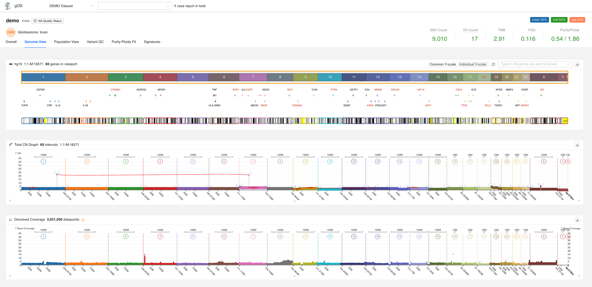

# gOS Deploy Builds

Welcome! This branch keeps ready-made builds of [gOS](https://github.com/mskilab-org/gOS) so you can try the app without compiling anything yourself. The artifacts here mirror what ends up on production and come with just enough data to poke around locally.

## What You Get Here
- `releases/` – versioned tarballs of the built gOS web app plus checksum files for integrity checks.
- `setup.sh` – a helper script that unpacks the newest build, wires in the shared data, and serves it on your machine.
- `shared/` – datasets and configuration snapshots that the app expects at runtime.

If you want to explore the original sources or contribute code, head over to the official repo: https://github.com/mskilab-org/gOS


## What It Looks Like
Curious about the end result? Here is the genome view from the demo case report included in this branch:



## Quick Start: Run gOS Locally
1. Make sure you have **Python 3** available (any modern macOS or Linux install should already include it).
2. From the root of this repository, run:
   ```bash
   ./setup.sh
   ```
   The script will print the build it is using, verify its checksum, unpack it into `out/`, copy the shared data, and finally launch a tiny Python HTTP server.
3. Open http://localhost:3001 in your browser. You now have the prebuilt gOS interface running locally. Hit **Ctrl+C** in the terminal when you’re done.

**Need a different port or want to skip the server?**
- `PORT=4000 ./setup.sh` – serves the app on port 4000 instead of 3001.
- `SKIP_SERVER=1 ./setup.sh` – performs the download and data merge but exits before starting the server (handy for automation).

## Live Demo (GitHub Pages)
Want a hosted demo you can share? This repo now ships with a GitHub Actions workflow that publishes the latest build to GitHub Pages every time you push to the `deploy-builds` branch (or whenever you trigger it manually).

**How to enable it:**
1. In your repository settings, open **Pages** and set **Build and deployment** to **GitHub Actions**.
2. Push to `deploy-builds` (or use **Run workflow** on `Deploy demo to GitHub Pages`) to produce the Pages artifact.
3. GitHub will show the public URL in the workflow summary and under the **github-pages** environment. It will look something like `https://<your-account>.github.io/gOS-deploy-builds/`. Replace the placeholder with your real URL once you've confirmed it works.

Once live, drop the link above so readers can click straight into the demo.

## The `shared/` Directory (Read This!)
The `shared/` folder contains the minimum data needed for the UI to feel real. Three files are essential:
- `shared/datasets.json` – registers the datasets the UI can load. Without this, the app has nothing to show in the sidebar.
- `shared/datafiles.json` – maps dataset identifiers to the actual files on disk so the viewer knows where to fetch each payload.
- `shared/settings.json` – user-visible defaults (theme, landing dataset, feature toggles) applied when the app boots.

You’ll also see subfolders like `shared/data/`, `shared/common/`, or `shared/genes/`. These hold sample payloads that match the entries above.

Not sure how to shape your own data? Start by looking at the demo configuration files (`shared/datasets.json`, `shared/datafiles.json`) and the example case report in `shared/data/demo/`. They show the required fields and file layouts, so you can mirror the same structure when you’re ready to add your own case reports. Once you add new files, update `datasets.json`, `datafiles.json`, and `settings.json` so gOS knows where to look.

## Troubleshooting Tips
- If `setup.sh` complains about Python, install it (e.g., `brew install python` on macOS).
- Check that `releases/` still contains the tarball referenced in `LATEST.txt`. If not, pull the latest changes from this branch.
- The HTTP server stops as soon as you close the terminal or press **Ctrl+C**; rerun `./setup.sh` whenever you need a fresh session.

That’s it! You now have a quick, no-build path to exploring gOS. Happy exploring.
