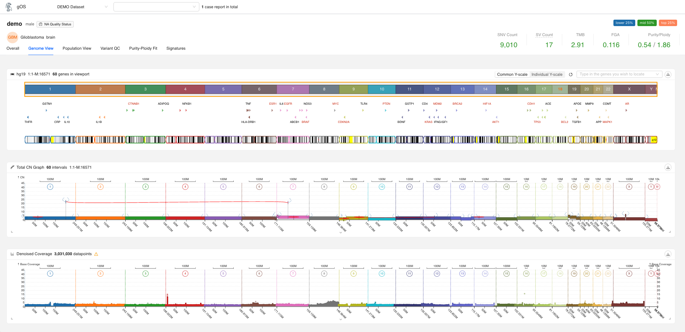

# gOS Case Report (prebuilt)

This repository now ships prebuilt bundles via **GitHub Releases** and publishes the latest build to **GitHub Pages**. You can run the app locally without rebuilding, explore the demo data baked into `shared/`, or develop from source with the usual React tooling.



## Quick start (no build required)
Prereqs: `python3`, `curl`, and `tar`. Optionally set `GITHUB_TOKEN` to avoid GitHub API rate limits.

```bash
./setup.sh
open http://localhost:3001
```

What happens:
- Fetches the latest **stable** GitHub Release for `mskilab/case-report` (override with `REPO=owner/repo`, `TAG=v1.2.3`, or `--channel edge`).
- Downloads `build-<sha>.tar.gz`, its checksum, and the `LATEST` metadata, verifies the checksum, and unpacks into `out/build-<sha>/`.
- Copies the `shared/` data into the unpacked build.
- Serves the static app on `PORT` (default `3001`). Set `SKIP_SERVER=1` to skip launching the server.

## Developing from source
```bash
yarn install --frozen-lockfile
CI=false yarn start   # dev server on http://localhost:3000
yarn test             # interactive tests
CI=false yarn build   # production build into ./build
```

## Shared data bundle
The `shared/` directory contains the minimum data/config the UI expects:
- `shared/datasets.json` – datasets the UI lists in the sidebar.
- `shared/datafiles.json` – maps dataset identifiers to files on disk.
- `shared/settings.json` – defaults for theme, landing dataset, feature toggles.
- `shared/data/`, `shared/common/`, `shared/genes/`, etc. – sample payloads that back the demo experience.

Add your own case report data by mirroring the structure above and updating the JSON manifests accordingly.

### Configuring datasets

The `datasets.json` file defines available datasets and their configuration. Each dataset entry supports:

```json
{
  "id": "my-dataset",
  "title": "My Dataset",
  "datafilesPath": "datafiles.json",
  "commonPath": "common/",
  "dataPath": "data/",
  "reference": "hg19",
  "defaultVisibleFilteredEventsColumns": ["gene", "tier", "custom-col"],
  "optionalFilteredEventsColumns": [
    {
      "id": "custom-col",
      "title": "Custom Column",
      "dataIndex": "customField",
      "viewType": "gene-link"
    }
  ],
  "schema": [
    {
      "id": "sample_type",
      "title": "Sample Type",
      "type": "string"
    }
  ]
}
```

**Filtered Events Columns:** Extend the filtered events list columns using `optionalFilteredEventsColumns`. Supports partial column definitions that merge with defaults. Use the optional `defaultVisibleFilteredEventsColumns` array as an ordered, exact allow-list of merged settings and dataset column IDs to select when the Filtered Events panel first mounts and when **Reset All Filters** is clicked. Listed IDs determine the default left-to-right order in the table. Omit the property to show every available column. Unknown IDs are ignored, duplicate IDs use their first position, and an empty array is valid. Columns supplied directly by a panel caller remain selected in their panel-defined position.

**Saved column layout:** Column widths and order are saved in one browser `localStorage` entry, `gos.filteredEventsColumnLayout.v1`. No user or sign-in is required, and signing in, switching users, or signing out does not change the layout. Matching data-column IDs reuse that layout across cases, datasets, and reloads; saved order overrides the configured default order. Dataset-specific columns retain their preferences when absent from another dataset. Fixed columns keep their positions, and caller-specific columns are not shared. Widths are saved at the end of a resize, not during dragging. **Reset All Filters** restores default column order and visibility while retaining widths, as before. Filters, sorting, visibility, and page size are not persisted. Blocked/full storage does not prevent table use. Preferences are local to this browser and site, not synchronized between browsers or devices. Older user-specific entries remain untouched but are no longer used.

Available `viewType` renderers:
- `"gene-link"` – renders gene names as clickable event-detail links
- `"event-detail-link"` – renders a value as a clickable link that opens event details
- `"tier-badge"` – renders tier/category badges
- `"formatted-number"` – renders formatted numeric values
- `"string-basic"` – renders plain text (default)
- `"location-link"` – renders genomic locations as links
- `"class-icon"` – renders class with icon

**Cohort Filters:** Define dataset-specific filters for the cohort-level view using `schema`. When provided, this overrides the default schema from settings. Each filter must include `id`, `title`, and `type`.

### Report styles and primary-site choices

Report presentation is selected by the dataset-level `reportStyle` property:

- Omit `reportStyle`, set it to `"myeloseq"`, or supply an unrecognized value to use the MyeloSeq HTML preview and DOCX download.
- Set `reportStyle` to `"classic"` to use the older classic HTML report for both preview and download.

MyeloSeq is the compatibility default. Only classic requires an explicit opt-in:

```json
{
  "id": "classic-dataset",
  "reportStyle": "classic"
}
```

The header's primary-site value is separate from `tumor_type`. A MyeloSeq dataset always shows the specimen selector, even when `metadata.primary_site` is missing, null, empty, or whitespace-only, or the dataset's `fields` omit `primary_site`. Existing loading and save restrictions still apply. With no saved or raw value, the selector shows its placeholder rather than choosing an option automatically. A classic dataset still shows only nonblank, schema-enabled raw primary-site metadata as ordinary, non-editable text.

The supplied MyeloSeq choices are exactly lowercase: **bone marrow aspirate**, **peripheral blood**, and **na**. They are configured in the top-level `primarySiteOptions.myeloseq` array in `public/settings.json` and `shared/settings.json`. There is no `Other` choice or whole-genome cancer-type fallback.

A MyeloSeq dataset can replace those choices with a custom array:

```json
{
  "id": "custom-myelo-dataset",
  "primarySiteOptions": [
    { "value": "custom specimen", "label": "custom specimen" },
    "na"
  ]
}
```

Reusable custom arrays may still be added to the global `primarySiteOptions` map and referenced by name. Missing, unknown, or malformed configuration falls back to `primarySiteOptions.myeloseq`. An explicit array replaces the catalog; `[]` stays empty. Invalid entries are dropped, surrounding whitespace is trimmed, and duplicate values keep their first label. No first option is selected automatically; existing out-of-list values remain displayable but cannot be selected again.

MyeloSeq selections use the existing interpretation backend: the dataset's `auditLoggingRepo` when configured, otherwise the existing IndexedDB repository. They are scoped to the active dataset, canonical case ID, and signed-in author. A `PRIMARY_SITE` interpretation saves `data.primarySite = { value, label }`; selecting **na** stores a real choice. Existing case-interpretation reset behavior also clears this override.

For MyeloSeq cases, the selected current-author snapshot takes precedence over `metadata.primary_site` and its label is used as report **Specimen Type**, regardless of source metadata or dataset fields. Classic reports and headers use the schema-enabled raw source primary site instead. Existing saved selections remain stored and become effective again when MyeloSeq style applies. Source metadata and tumor type are never rewritten. When neither a saved selection nor raw metadata is available, the MyeloSeq report renders Specimen Type as `NA`.

### MyeloSeq report display

- **Tumor sample** shows `metadata.pair` exactly as supplied by the backend, falling back to the source case ID only if pair is absent. Report titles and filenames still use the source case ID.
- A fusion event may provide a nonblank `locus`, for example `"22:23632600,9:133729451"`. The report displays it as `chr22:23632600-chr9:133729451` in both Locus and Breakpoint. If `locus` is missing or blank, the existing `fusion_gene_coords`, `location`, or `Genome_Location` is used, in that order. Gene ranges are never converted into guessed breakpoints.
- Event **Comments** show `variant_summary` as supplied by the backend, without removing any source tags in the frontend. HTML output still escapes markup; source records are not modified.

These display rules apply to both the MyeloSeq HTML preview and Word export; classic report display is unchanged.

## Deployments
- **Edge channel (latest `main`):** `.github/workflows/build-artifacts.yml` builds on every push to `main` and publishes a GitHub **prerelease**. This is intended for an “edge” instance that should always track the newest commit on `main`.
- **Stable channel (promoted builds):** Use `.github/workflows/promote-stable.yml` to promote a specific `build-*` prerelease to a **stable** (non-prerelease) release. The GitHub `.../releases/latest` endpoint will then point at the promoted release.
- **GitHub Pages:** The build workflow also deploys to the `github-pages` environment, so the live Pages site tracks the edge channel.

### Picking what to deploy
- **Edge instance:** deploy the most recent release (including prereleases). In GitHub API terms, call `GET /repos/:owner/:repo/releases` and pick the first entry.
- **Staging instance:** deploy only stable releases via `GET /repos/:owner/:repo/releases/latest` (this endpoint ignores prereleases).

### Running locally
- Stable (default): `./setup.sh`
- Edge: `./setup.sh --channel edge`

The legacy `deploy-builds` branch is no longer used; artifacts now live solely on GitHub Releases.

## Troubleshooting
- If downloads fail, set `GITHUB_TOKEN` (PAT or Actions token) to raise the GitHub API limit.
- If the checksum mismatches, rerun `./setup.sh` to redownload the assets.
- Ensure `python3` is on your `PATH`; it powers the local HTTP server.
